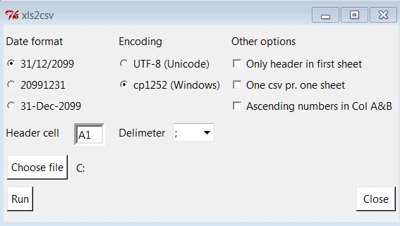
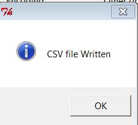
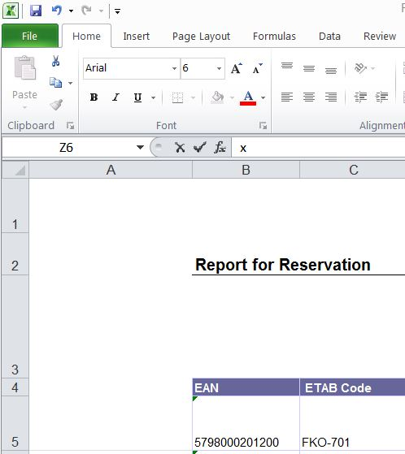

xls2csv
=======

convert a xls workbook with several sheets to one csv file

This script used the excel api from the win32com package. Therefore it will only work on a windows machine with Microsoft excel installed. The code is written in python2

To run it do "python src/gui.py"

To build a windows executeable run "python src/build.py build"

Some builds has been zipped as xls2csv.zip in the folder builds. To use it unpack it and run xls2csv.exe. The builds are build on a windows 7 machine and will therefore not work on windows xp machines.

A screenshot of the interface.

If a csv file has been written the following picture will be shown. If it does not appear something has gone wrong but the error will not be shown at the moment.

 
# Options

## Date format
Choose the wanted format for the date

## Encoding
Choose the wanted encoding

## Other Options
### Only header in first sheet
Choose this if the workbook only has a header on the first sheet and data starts in A1 in the rest of the sheets. The data on all the sheets must have the same format.

### One csv pr. one sheet
Choose this if you want one csv file for each sheet you have. It is assumed that the header starts in the same cell for all sheets.

### Acending number i Col A&B
Choose this if you want asending number in column A and B starting with the number 1. It will looks like this.

| A | B | C ....|
|---|---|-------|
| 1 | 1 |	     |
| 2 | 2 | 	     |
| 3 | 3 |       |
| 4 | 4 |       |
| . | . |       |
| . | . |       |
| . | . |       |

## Header cell

The header cell field must contain the cell number where the header starts on a sheet. The picture belows shows a sheet where the header starts in cell number "B4"

## Delimiter 
Choose the wanted delimeter.

The icon for the windows exe file has been taken from
http://findicons.com/icon/download/101352/microsoft_office_excel/128/ico?id=101550
