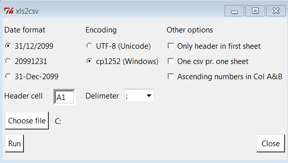

xls2csv
=======

convert a xls workbook with several sheets to one csv file

This script used the excel api from the win32com package. Therefore it will only work on a windows machine with Microsoft excel installed. The code is written in python 3

To run it do "python src/gui.py"

To build a windows executeable run "python src/build.py build"

Some builds has been zipped as xls2csv.zip in the folder builds. To use it unpack it and run xls2csv.exe. The builds are build on a windows 7 machine and will therefore not work on windows xp machines.

A screenshot of the interface.

 

The icon for the windows exe file has been taken from
http://findicons.com/icon/download/101352/microsoft_office_excel/128/ico?id=101550
